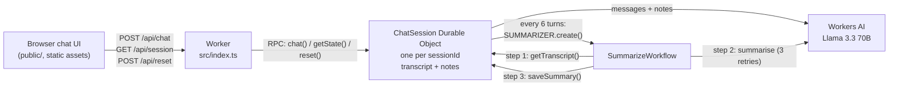

# cf_ai_interview_coach

An AI mock-interview coach built entirely on Cloudflare. You chat with a Llama 3.3 interviewer that asks one
question at a time, gives feedback on each answer and adapts the difficulty. Every session remembers its
conversation, and a background Workflow condenses it into long-term **coach notes** (target role, strengths,
weak spots, what to practise next) that are fed back into later turns.

> Live demo: https://cf-ai-interview-coach.dhruv-15-03.workers.dev

## How it maps to the assignment

| Requirement                         | Implementation                                                                                                 | Code                                          |
| ----------------------------------- | -------------------------------------------------------------------------------------------------------------- | --------------------------------------------- |
| LLM                                 | Llama 3.3 70B on Workers AI (`@cf/meta/llama-3.3-70b-instruct-fp8-fast`) for both chat replies and note-taking | `src/ai.ts`, `src/prompt.ts`                  |
| Workflow / coordination             | A Durable Object per session serialises turns; a **Workflow** runs the retried, multi-step summarisation job   | `src/session.ts`, `src/workflow.ts`           |
| User input via chat                 | Chat UI served as Workers static assets (the Workers equivalent of Pages), calling a small JSON API            | `public/`, `src/index.ts`                     |
| Memory or state                     | SQLite-backed Durable Object storage: transcript (short-term) and coach notes (long-term)                      | `src/session.ts`                              |

## Architecture



**One chat turn**

1. The browser keeps a random `sessionId` (a UUID in `localStorage`) and sends `{ sessionId, message }` to `POST /api/chat`.
2. The Worker validates the body (size, JSON, id format, message length) and calls the session's Durable Object by
   name (`idFromName(sessionId)`), so every request for a session reaches the same single-threaded instance.
3. `ChatSession.chat()` loads the notes and transcript, builds the prompt (system prompt, then the coach notes, then
   the last 12 messages, then the new message) and calls Llama 3.3.
4. Only after the model replies does it write the user message, the reply and the new turn count in **one** storage
   `put`, so a failed model call never leaves a half-written turn.
5. Every 6 turns it starts a `SummarizeWorkflow` instance. The reply is returned immediately; summarisation happens
   in the background.

**Summarisation (the Workflow)**

1. `load transcript`: read the last 20 messages and the current notes from the Durable Object.
2. `summarize with Llama 3.3`: merge the old notes and the new transcript into at most 12 bullets. The step retries up
   to 3 times with exponential backoff and has a 2-minute timeout.
3. `save summary`: write the notes back. Each step's result is persisted by Workflows, so a retry of step 2 never
   re-reads the transcript, and a restart after step 3 never writes twice.

**Correctness details worth knowing**

- *Turn ordering.* A Durable Object's input gate normally stops requests interleaving, but it opens while the object
  awaits an outside call such as Workers AI. `ChatSession` therefore chains every mutation on a promise
  (`#exclusive`), so two quick messages from the same session are processed strictly one after the other.
- *Reset races.* `reset()` bumps an `epoch` counter. A summary job carries the epoch it was started with, and
  `saveSummary()` refuses to write if the epoch has changed, so notes from a deleted conversation can never reappear.
- *No duplicate jobs.* A `summaryPendingSince` timestamp stops a second job starting while one is running. If a job
  dies without reporting back, a new one is allowed after 10 minutes.
- *Bounded state.* At most 60 messages are stored per session, and notes are capped at 2,000 characters.

## Run it locally

Prerequisites: Node.js 22 (22.12 or later), 24 or 26+ (the range Vitest 5 supports), and npm.

```bash
npm install
npm test            # vitest unit tests, all Cloudflare bindings mocked
npm run typecheck   # strict TypeScript: worker, tests and the browser script
npm run check:types # confirms worker-configuration.d.ts matches wrangler.jsonc
```

The tests need no Cloudflare account. They run in Node with a small stub of `cloudflare:workers`
(`test/stubs/`) and in-memory fakes for Durable Object storage, Workers AI, the Workflow binding and the assets
binding (`test/helpers.ts`).

To run the full app on your machine:

```bash
npx wrangler login
npm run dev         # http://localhost:8787
```

The Workers AI binding always calls Cloudflare's hosted models, even under `wrangler dev`, so local development
needs a login and uses your account's Workers AI allowance. Durable Objects, Workflows and static assets are simulated
locally by Wrangler.

## Deploy

```bash
npx wrangler login
npx wrangler deploy
```

Wrangler creates the Worker, the `ChatSession` Durable Object class (migration `v1`, SQLite-backed), the
`cf-ai-interview-coach-summarizer` Workflow and the static assets, then prints the `https://cf-ai-interview-coach.<your-subdomain>.workers.dev` URL.

Useful afterwards:

```bash
npx wrangler tail                                             # live logs
npx wrangler workflows instances list cf-ai-interview-coach-summarizer
```

## API

All responses are JSON with `cache-control: no-store`. `sessionId` must match `^[A-Za-z0-9_-]{8,64}$`, a message
may be at most 4,000 characters, and request bodies at most 16 KiB.

| Method | Path                         | Body                          | Success response                                         |
| ------ | ---------------------------- | ----------------------------- | -------------------------------------------------------- |
| POST   | `/api/chat`                  | `{ "sessionId", "message" }`  | `{ "reply", "turns", "summaryScheduled" }`               |
| GET    | `/api/session?sessionId=...` | none                          | `{ "sessionId", "turns", "summary", "summaryPending", "messages" }` |
| POST   | `/api/reset`                 | `{ "sessionId" }`             | `{ "ok": true }`                                         |

Errors: `400` invalid input, `404` unknown API path, `405` wrong method (with an `Allow` header), `413` body too
large, `502` the model call failed, `500` anything unexpected. Any path outside `/api/` is served from `public/`.

## Design decisions

- **Plain Durable Objects and Workflows rather than the Agents SDK.** The Agents SDK would provide chat state and
  scheduling out of the box, but writing the two primitives directly keeps every moving part visible and small
  enough to explain line by line.
- **Why a Workflow for memory.** Summarisation is slow, can fail, and is not needed to answer the current message.
  Running it as a Workflow keeps chat latency to a single model call and gives retries, timeouts and per-step
  checkpoints without hand-written retry logic.
- **Short-term and long-term memory.** The model sees the last 12 messages verbatim plus the condensed notes, so the
  prompt stays small however long the session runs.
- **Static assets instead of a separate Pages project.** One `wrangler deploy` ships the UI and the API together on
  one origin, so there is no CORS to configure.
- **Safe rendering.** The UI writes every message with `textContent`, never `innerHTML`, so model output cannot inject
  markup.

## Limitations and next steps

- Replies are not streamed; streaming tokens from Workers AI over server-sent events would make the UI feel faster.
- There is no authentication or rate limiting. Anyone who knows a `sessionId` can read that session, and a public
  deployment should add Cloudflare's Rate Limiting binding or Turnstile before sharing widely.
- The tests are unit tests with mocked bindings. An integration suite using `@cloudflare/vitest-pool-workers` would
  exercise real Durable Object storage and Workflows inside `workerd`.
- Voice input (Realtime) is not implemented.

## Project layout

```
src/
  index.ts        Worker entry: routing, validation, error mapping, static-asset fallback
  session.ts      ChatSession Durable Object: memory, turn ordering, summary scheduling
  workflow.ts     SummarizeWorkflow: load → summarise → save
  ai.ts           Workers AI call and response parsing
  prompt.ts       System prompts and prompt builders
  validation.ts   Request validation
  types.ts        Shared types
public/           Chat UI (index.html, app.js, styles.css)
test/             Vitest suites, mocks (helpers.ts) and the cloudflare:workers stub
wrangler.jsonc    Bindings: AI, Durable Object, Workflow, static assets
PROMPTS.md        AI prompts used to build this project
```
